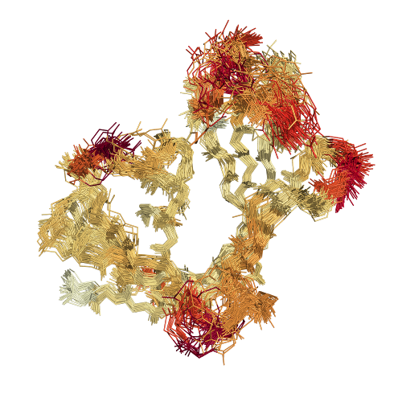
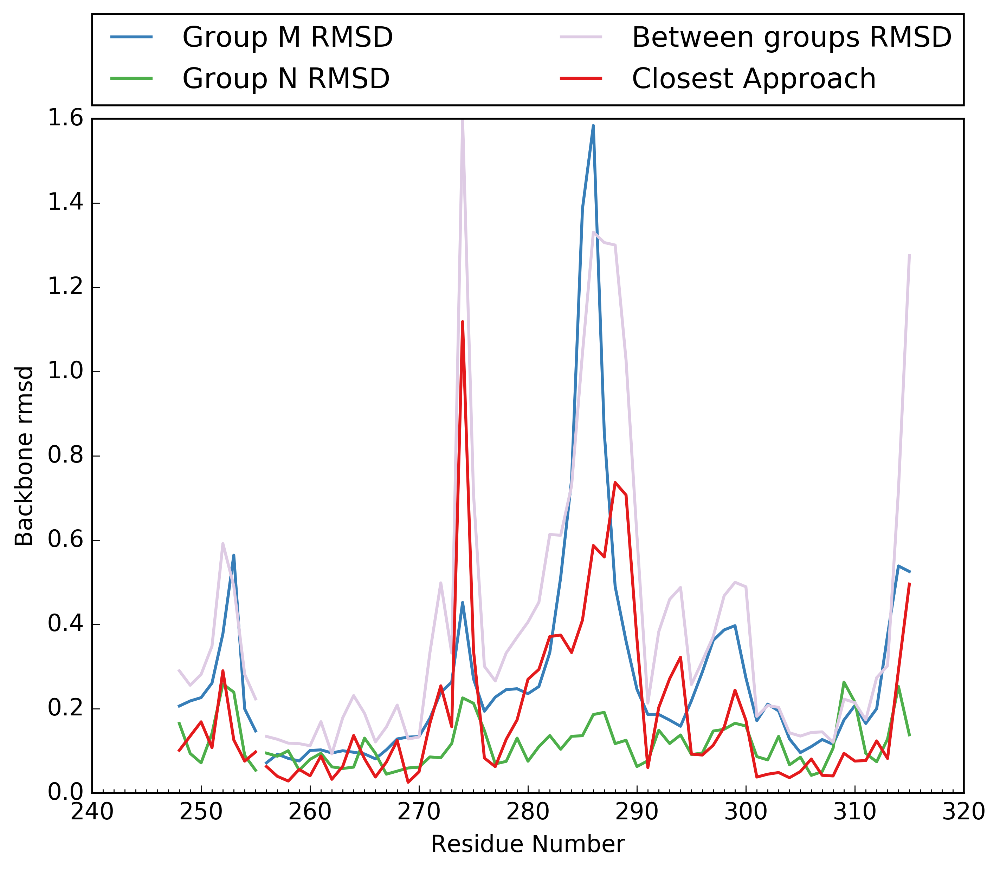
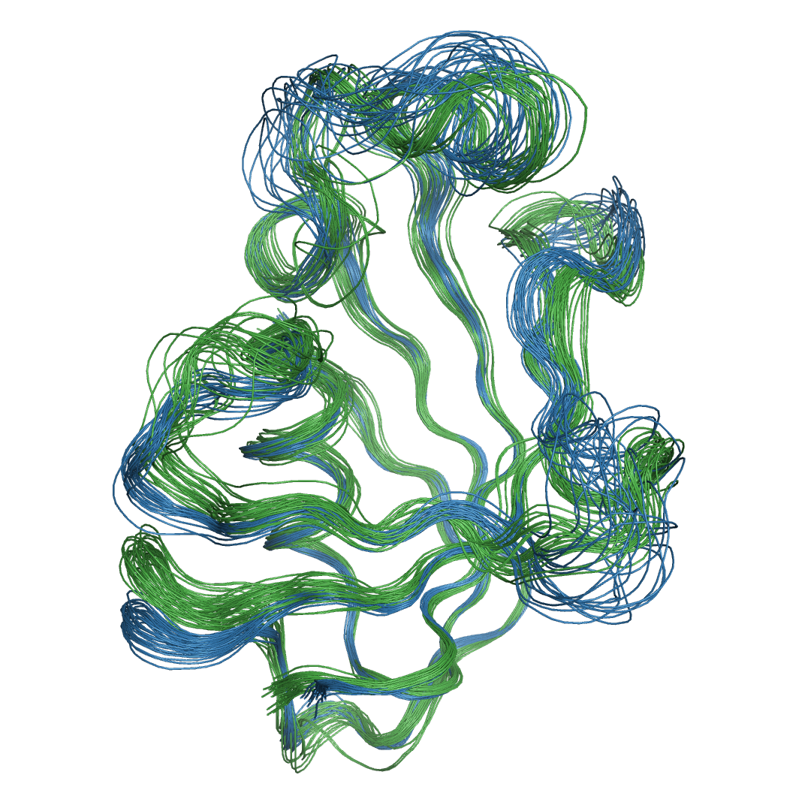

#######################
ENSEMBLATOR version 3
#######################

Andrew E. Brereton - Oregon State University - 2016
###################################################

Hello! Welcome to the *Ensemblator*. The purpose of this readme is to help 
you install and use the *Ensemblator* to best effect. The purpose of this 
program is to create ensembles from pdb files, and then to intelligently 
compare those ensembles. Many useful insights can be gained from directly 
comparing two whole ensembles; as well, there is an option to automatically
try to identify different groups within a single ensemble, and compare 
those.

	

Table of Contents
******************

* `Installation <installation>`_

	
Installation:
**************

There are a few ways to install and use the *Ensemblator*:

1. Download a `binary <download_binary.md>`_ for your system, and ensure it is executable. Then run it! To use the seqeunce alignment functionality you will still need to seperatly install 'muscle', as described below.
2. Run the source code:
   
   a. `ensemblator.py <ensemblator.py>`_ - The GUI version of the *Ensemblator*. As above you will need to make it executable, or run it using python from the command line. Unlike running from the binary, you will need to ensure you meet all the requirements outlined in the section below.
   b. `ensemblator_cli.py <ensemblator_cli.py>`_ - The CLI version of the *Ensemblator*. The installation is the same as for the GUI version, simply download, mark as executable, and ensure you meet all the requirements. The usage is different, in that this version operates from the command line, and thus is more amenable to being part of a automated pipeline.

Requirements
*************

Strict:
========

To use the *Ensemblator* source code, you will require Python 2 to be installed on your
system. Furthermore, you will need the following python packages:

* numpy
* biopython
* matplotlib

Optional:
==========

* `muscle <http://www.drive5.com/muscle/>`_
   
   This software is needed for doing sequence alignments when building ensembles. This feature is VERY useful, I highly reccomend it. Make sure that it is installed, and in your path as 'muscle'. If you have muscle in your path, but are still encountering errors, please try running from the command line. Sometimes when clicking the icon from the desktop, the PATH variable does not get imported correctly. I don't really know why this happens.

* SciPy
   
   This python package is needed for the automatic clustering features of the Analysis portion of the *Ensemblator*. Again, these features are very useful, so it's reccommended that you install this package.
    
Usage:
*******

The main menu:
===============

.. image:: screenshots/main_menu.png

Prepare Input
^^^^^^^^^^^^^^

Clicking this will open a window for preparing input for analysis. The *Ensemblator* requires very specifically prepared ensembles, and this section of the program handles that. The final output here will be a pdb file of the prepared ensemble, and a legend that contains information on which model in the ensemble is associated with which input file. For more details, see below.

Analyze
^^^^^^^^

This is the section of the *Ensemblator* that does the heavy lifting. Here, your prepared ensemble will be analyzed to find a common core, overlayed, and various groups within the ensemble will be compared (groups of your choosing, or automatically detected groups). The final output here will be various plots showing statistics, pdb files for each group (overlayed by core atoms), and a global overlay pdb file (also overlayed by core atoms). For more details, see below.

Exit 
^^^^^

This exits the program.

Preparing your files for analysis:
====================================

.. image:: screenshots/prepare_input.png

The purpose of this part of the program is to create an ensemble which only contains all the atoms common to each of the structures. It does this using the residue ID and the atom type. *ie.* All the residue 46 CA atoms need to be present in all structures to be included. This is important to consider, as if the numbering of the residues is different, only backbone atoms will be kept, and the subsequent analysis by the Ensemblator will be weird. There are always at least two outputs from this script: your output  ensemble, and a legend that will contain the model id associated with each input structure. 

Select Input Files
^^^^^^^^^^^^^^^^^^^
    
    Used to specify the input. This should be a pdb file with at least two models, chains, or alternate conformations. Furthermore, any number of pdb files can be used, and all will be combined into the final prepared ensemble.

Select Working Directory
^^^^^^^^^^^^^^^^^^^^^^^^^

    
Analyzing your prepared ensemble:
==================================

Understanding the output:
==========================

                
Known Bugs:
************

* IO erros on Windows. 

    This is a result of the rate at which the *Ensemblator* saves and deletes intermediate files. It seems to be too fast for Windows, and sometimes results in a permission error that crashes the system. It's still possible to use the *Ensemblator* on Windows, but you will have to click "Go" again and again. It's basically unusable and would require a considerable rewrite to get things working smoothly on Windows. For now, I don't have any options for you.

* command 'muscle -in <somefile> -out <somefile>' not found. (Even though you really do have muscle installed) 

    This is a PATH related problem. Starting the *Ensemblator* from the command line using the source code seems to resolve this, as long as you really do have muscle in your path as 'muscle'. (eg. bash>$ python *Ensemblator*.py)

* The binary file I downloaded doesn't do anything! 

    There is probably some missing dependency. Try downloading either the CLI or the GUI source code, and running it yourself, after installing the various dependencies. The binary file works on my machine (where it was compiled), and a few other similar machines, but I know for a fact it doesn't work on all linux machines.

Bug Reports:
*************

Please submit any issues if you have a bug!

