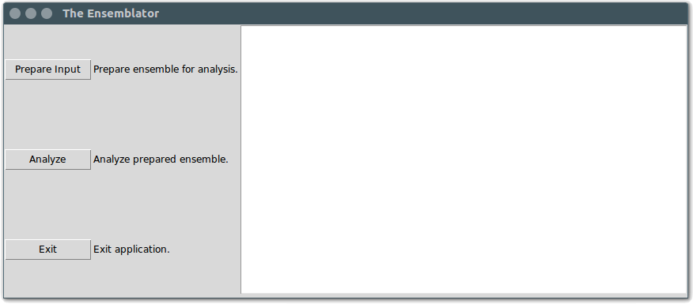

#######################
ENSEMBLATOR version 3
#######################

Andrew E. Brereton - Oregon State University - 2016
###################################################

Hello! Welcome to the *Ensemblator*. The purpose of this readme is to help 
you install and use the *Ensemblator* to best effect. The purpose of this 
program is to create ensembles from pdb files, and then to intelligently 
compare those ensembles. Many useful insights can be gained from directly 
comparing two whole ensembles; as well, there is an option to automatically
try to identify different groups within a single ensemble, and compare 
those.

..  image:: screenshots/all3.png

Table of Contents
******************

* `Installation <#installation>`_

* `Requirements <#requirements>`_

* `Usage <#usage>`_
    
    + `The main menu <#the-main-menu>`_
    
    + `Preparing your files for analysis <#preparing-your-files-for-analysis>`_
    
    + `Analyzing your prepared ensemble <#analyzing-your-prepared-ensemble>`_
    
    + `Understanding the output <#understanding-the-output>`_

* `Known Bugs <#known-bugs>`_

* `Bug Reports <#bug-reports>`_

	
Installation:
**************

There are a few ways to install and use the *Ensemblator*:

1. Run the source code:
   
   a. `ensemblator.py <ensemblator.py>`_ - The GUI version of the *Ensemblator*. As above you will need to make it executable, or run it using python from the command line. Unlike running from the binary, you will need to ensure you meet all the requirements outlined in the section below.
   b. `ensemblator_cli.py <ensemblator_cli.py>`_ - The CLI version of the *Ensemblator*. The installation is the same as for the GUI version, simply download, mark as executable, and ensure you meet all the requirements. The usage is different, in that this version operates from the command line, and thus is more amenable to being part of a automated pipeline.

Requirements
*************

Strict:
========

To use the *Ensemblator* source code, you will require Python 2 to be installed on your
system. Furthermore, you will need the following python packages:

* numpy
* biopython
* matplotlib
* SciPy
* scikit-learn

Some of these packages might be difficult to install using pip, but an alternative could be to use a scientific python installation like Anaconda.

Optional:
==========

* `muscle <http://www.drive5.com/muscle/>`_
   
   This software is needed for doing sequence alignments when building ensembles. This feature is VERY useful, I highly recommend it. Make sure that it is installed, and in your path as 'muscle'. If you have muscle in your path, but are still encountering errors, please try running from the command line. Sometimes when clicking the icon from the desktop, the PATH variable does not get imported correctly. I don't really know why this happens.

    
Usage:
*******

The main menu:
===============

Prepare Input
^^^^^^^^^^^^^^

Clicking this will open a window for preparing input for analysis. The *Ensemblator* requires very specifically prepared ensembles, and this section of the program handles that. The final output here will be a pdb file of the prepared ensemble, and a legend that contains information on which model in the ensemble is associated with which input file. For more details, see below.

Analyze
^^^^^^^^

This is the section of the *Ensemblator* that does the heavy lifting. Here, your prepared ensemble will be analyzed to find a common core, overlayed, and various groups within the ensemble will be compared (groups of your choosing, or automatically detected groups). The final output here will be various plots showing statistics, pdb files for each group (overlayed by core atoms), and a global overlay pdb file (also overlayed by core atoms). For more details, see below.

Exit 
^^^^^

This exits the program.

Preparing your files for analysis:
====================================

The purpose of this part of the program is to create an ensemble which only contains all the atoms common to each of the structures. It does this using the residue ID and the atom type. *ie.* All the residue 46 CA atoms need to be present in all structures to be included. This is important to consider, as if the numbering of the residues is different, only backbone atoms will be kept, and the subsequent analysis by the Ensemblator will be weird. There are always at least two outputs from this script: your output  ensemble, and a legend that will contain the model id associated with each input structure. 

Select Input Files
^^^^^^^^^^^^^^^^^^^
    
    Used to specify the input. This should be a pdb file with at least two models, chains, or alternate conformations. Furthermore, any number of pdb files can be used, and all will be combined into the final prepared ensemble.

Select Working Directory
^^^^^^^^^^^^^^^^^^^^^^^^^

    Used to select the directory in which all the intermediate files will be created (and deleted) as well as where the output files will be saved.

Ensemble output filename
^^^^^^^^^^^^^^^^^^^^^^^^^

    Used to specify the final name of the output ensemble.

Chain-breaks permitted?
^^^^^^^^^^^^^^^^^^^^^^^^

    There are three choices available for this option: "none", "some", and "all". Selecting "none", the default behavior, will result in the behavior that when building the ensemble from your input structures, any model that has a break in the backbone will not be included in the final ensemble. This prevents the introduction of gaps into the final ensemble. However, sometimes all the models contain some gaps. In this case it becomes more important to choose either "all", which will allow all models, or "some", which will allow only models with less than a certain number of chain-breaks.

# of chain-breaks permitted
----------------------------

    This defines the number of chain-breaks allowed to be present before a model is considered "bad" and removed from the final ensemble. This option is only relevant if the user has selected "some" for the option "Chain-breaks permitted?". Increasing this number will make the final ensemble have more and more missing atoms, as more models with gaps will be included in the final ensemble. This option is particularly useful when dealing with datasets where every structure has some number of gaps, but a few poor quality structures have many more gaps.

    
Perform sequence alignment
^^^^^^^^^^^^^^^^^^^^^^^^^^^

    Setting this option will do multiple sequence alignment using MUSCLE, which must be installed on the user's computer. This multiple sequence alignment will be used to renumber the structures to ensure that all residues are correctly matched. This will output a file: 'muscle\_align.fasta'. This file is the fasta formatted alignment that was used to generate the new numbering of the residues.

Select Template File
-----------------------

    This option is required when doing an alignment. This option is used to define a template that all the aligned sequences will be compared to. If they are less than a certain percent identity (by default 70%) they will not be included in the analysis.

Chain ID for template
----------------------

    Which chain in the template file do you want to use as a standard? Default is "X", which is also what should be used if the template file does not have any chains labeled. This entry is **case sensitive**! "a" does not equal "A", and will give errors.

Model ID for template
----------------------

    As above, but for model IDs. By default 0 is used, but any number will work. If there are no model labels in the template file, just leave this as 0.

Percent ID Cutoff
------------------

    This will allow you to set the percent identity to use when deciding to keep structures or not. You can use percentages (ie. 70, 100, or 35.6546), or you can use fractional percentages (ie. 0.5 will be treated as 50%).

Go!
^^^^
    Build the ensemble!
    
Analyzing your prepared ensemble:
==================================

.. image:: screenshots/analyze_ensemble.png

Select Working Directory
^^^^^^^^^^^^^^^^^^^^^^^^^^

    Used to select the directory in which all the intermediate files will be created (and deleted) as well as where the output files will be saved. If automatic clustering is used, the legends for the groups will be appended to 'models.tsv' if it is in this directory.

Select Input Ensemble
^^^^^^^^^^^^^^^^^^^^^^^

    Use this option to select an ensemble prepared by the `Preparing your files for analysis <#preparing-your-files-for-analysis>`_ part of the *Ensemblator*.

Cutoff distance for core atoms
^^^^^^^^^^^^^^^^^^^^^^^^^^^^^^^

    A value in Angstroms to use as a distance cutoff to define the common core of your ensemble. The default value for this calculation is 2.5. Choosing this value is important, and different cutoff values will often give different results. It is valuable to play around to determine what works best for your ensemble. Roughly, the same atom seen in two different models will be considered a 'core' atom, if it is within this cutoff distance. Otherwise, it will be excluded from the core.

Group M models
^^^^^^^^^^^^^^^

    Define group M for analysis. If not using the auto option, then at least group M must be defined. Members of a group can be separated by commas, as well as ranges specified using dashes. For example, to specify all 20 members of an ensemble as group M, you would type '-m 0-19'. To specify only some, you might type '-m 0-4,13-19'.

Group N models
^^^^^^^^^^^^^^^^

    Define group N for analysis and comparison to group M.

Perform automatic clustering
^^^^^^^^^^^^^^^^^^^^^^^^^^^^^

    This option will allow the user to avoid telling the Ensemblator which groups to compare. Instead, the program will do all the pairwise analysis, and then use these results to determine the best clusters to compare. 
 

Max # of clusters to search for
--------------------------------

    Allows the user to specify a maximum number of clusters to identify within the ensemble. By default this number is 3. This can be increased as high as the user wants, or as low as 2. Higher values will not significantly increase the computation time, but can lead to less useful results. This value is worth playing around with.

Use average deviation rather than RMSD
^^^^^^^^^^^^^^^^^^^^^^^^^^^^^^^^^^^^^^^

    As stated, for all calculations and results this will used the average deviation rather than the root-mean-square deviation. This should be more robust to extreme outliers. This *will* change the clusters that are detected using the automatic methods.

Set b-factors in final ensemble equal to inter-LODR (or group M LODR)
^^^^^^^^^^^^^^^^^^^^^^^^^^^^^^^^^^^^^^^^^^^^^^^^^^^^^^^^^^^^^^^^^^^^^^

    Setting this will result in the final models output having the b factors replaced with the Inter-group (if more than one group) or Group M LODR. This allows easy visualization in pymol using the "spectrum b" command (an example of this is the figure at the top of this page).

Understanding the Output:
==========================

Understanding the Algorithms
^^^^^^^^^^^^^^^^^^^^^^^^^^^^^

Generating the Ensembles
-------------------------

    During the steps involved with preparing the ensemble for input into the analysis steps, there are a few important things to note. The first thing to know is that every pdb file is going to be separated into a unique pdb file (temporarily) for each model, chain, and alternate conformation in the original input file. Each combination of these factors will end up as a distinct model in the final prepared ensemble (eg. **4XRA\_model\_0\_chain\_A\_alt\_A**).
    
    The next important thing to note is that any atoms that are not present in all the models will be removed from the final prepared ensemble. For example, if a member of the ensemble has a serine mutated to a threonine, the methyl group on the threonine side chain will not be present in the final ensemble, and thus will not be analyzed directly. The **effects** that it causes on other atoms will be analyzed however. 

Finding the Best Overlay (the "common core atoms")
---------------------------------------------------

    The best overlay is determined based on the distance cutoff provided, by iteratively  overlaying pairs of models. The program will first take one pair of models, overlay them using all atoms, then identify which atom-pairs (ie. residue 12 Cα for both models) are within the distance cutoff specified. If yes, then this atom is labeled as a "core atom". Then, the overlay is repeated, but this time only considering the core atoms. Then again the new set of core atoms is identified, the overlay repeated, etc. etc.
    
    This step finishes when the same set of core atoms is returned twice in a row. The program then records all the core atoms, and moves on to the next pair of models. After every pair is finished, the "common core" is identified as the atoms that are considered core atoms in every pair of models. Then, all the models are overlayed a final time, this time only considering the common core atoms. This is the final overlay that is used to determine the eeGlobal and eeLocal statistics. As well, the features used to cluster the models are generated and saved in "pairwise\_analysis.tsv" during this step.

Calculating LODR
--------------------

    The locally overlaid dipeptide residual (LODR) is a simple distance-based quantity that does not define individual conformations but defines how closely two conformations compare. Conceptually, it reports information on each residue, by considering the dipeptide unit it makes with the previous residue. To calculate it, first the dipeptides are overlayed based on the Cα, C, O, N, and Cα atoms of the peptide unit preceding the residue, and then the LODR-score is defined as the RMSD between the C, O, N and Cα atoms in the subsequent peptide unit. Given this definition, no LODR values will exist for the first and last residues in a protein (as there are not complete peptide units on both sides of these residues), or for residues bordering chain-breaks. For more details see `this paper by Clark, Tronrud, and Karplus, which describes a much older version of the Ensemblator. <http://onlinelibrary.wiley.com/doi/10.1002/pro.2714/abstract>`_

Calculating Silhouette-like Score
---------------------------------

    For a given M,N pair of grouped structures, for each of the two groups, every atom’s global silhouette score is calculated as the mean pairwise distance between the groups minus the mean pairwise distance within the group, divided by the higher of the two values: 

    *a* = mean(d\ :sub:`intra`)
    
    *b* = mean(d\ :sub:`inter`)
    
    *Silhouette Score* = ( *b* - *a* ) / max(*b*,*a*)

    Then the silhouette scores for each atom are averaged across the two groups, and a residue-based value is then obtained by averaging the values for the N, CA, C, and O atoms of each residue. Another silhouette score for the local backbone conformation comparison is similarly calculated for each residue based on the locally-overlaid dipeptide residual (LODR) distances. A final silhouette index for a residue is the average of the global and local silhouette scores. The level of detectable difference between the groups increases as the index goes from near 0 to near 1. In the intermediate ranges, which we subjectively defined as 0.35 – 0.65, we consider the groups are neither notably similar nor notably different; in these ranges, more fine clustering could reveal subgroups with more notable differences.

    
Clustering Methods
-------------------

    The *distance score* for each pair of models is used to cluster the models. The distance score is defined as follows:
    
        *distance score* = RMSD\ :sub:`c`\ :sup:`p` * RMSD\ :sub:`nc`\ :sup:`1 - p` 
        
        Where:
        
            * RMSD\ :sub:`c` is the RMSD of all the core atoms
            * RMSD\ :sub:`nc` is the RMSD of all the non-core atoms
            * p is the fraction of atoms in the core

    Using this score (which is similar to a weighted geometric mean) places a preferential weighting on things that are more similar, rather than things that are more different. In this way, being different (which is possible in many ways) contains less information about overall similarity than being the same (which is only possible in one way). This is best exemplified in the extreme case, where, for example, the core RMSD is 0. In this case, the overall distance score will be zero, even if the non-core is very different, meaning these two molecules will have a high similarity. This is different from an equation using sums, in which the deviant not-cores can still create distant partners even when the cores are identical.

    The actual clustering performed using this distance metric is an Ensemble Clustering method. First, Affinity Propagation (REF) is used, finding clusters with a preference value that increases (in magnitude) by 1% each iteration, until the number of clusters is the same as the number of models. Next, k-means clustering is performed, with increasing K (number of clusters). K increases from 2 to N-1, and ten iterations for each K value are done (due to the random nature of the centroid initializations). 
    These experiments will fill a co-occurrence matrix, to be used for Evidence Accumulation (REF), which records how often each model is clustered with each other model. Finally, Agglomerative hierarchical clustering is performed on this co-occurrence matrix, to provide the final clusters used for comparisons. The K value used will be whatever provides the highest mean Silhouette Score, between 2 and the maximum provided.

The Output Files
^^^^^^^^^^^^^^^^^^^^

'model\_legend.tsv'
---------------------

    This tab-separated table contains information about which models originally belonged to which input files, chains, and alternate conformations. As well, if automatic clustering is used and this file is present in the working directory, the group ID will be added to this legend as an additional column.

'pairwise\_analysis.tsv'
---------------------------------------

    This tab-separated table contains information about each of the pairs of models. From left to right, the columns list: the id of model x, the id of model y, the percent of the total atoms in the core for this pair, the rmsd for all non-core atoms in the two structures, the rmsd for only the core atoms in this pair of structures, and the *distance score* calculated for these to structures (`see clustering methods for explanation <#clustering-methods>`_).

'clustering_silhouette_scores.tsv'
----------------------------------

    This tab-separated table contains the calculated mean Silhouette Index for each value of K, up to the Maximum Value Observed. This is useful to determine why a certain value of K might have been selected for the final value for K (whichever has the highest silhouette index will be chosen).

'eeGlobal\_out.tsv'
---------------------------------------

    This tab-separated table contains information each atom in the ensemble. From left to right the columns describe: the residue id of the atom, the atom type, the RMSD of the atom calculated pairwise from group M (ie. the RMSD of all the pairwise distances in group M), the same for group N, the same but calculated from each M to N pair, the closest distance between any member of M with any member of N, the pair of models which actually had that closest approach, and whether or not this  atom was included in the common core calculated for the ensemble, as well as the Global Silhouette score for each atom.

'eeLocal\_out.tsv':
---------------------------------------
      
      This tab-separated table contains information about the LODR calculated for each residue. The columns list from left to right: the residue id, the RMS of the LODR calculated for each pair of structures in group M, the same for group N, the same for each M to N pair, the minimum LODR for any member of M compared with any member of N, and which pair was that closest, as well as the LODR silhouette score.
      
'sil_scores.tsv':
---------------------------------------
      
      This tab-separated table contains information about the quality of the clusters discovered. The columns are the model id, the group id, and the score. The silhouette score is defined (from wikipedia) as:
        
            The silhouette value is a measure of how similar an object is to its own cluster (cohesion) compared to other clusters (separation). The silhouette ranges from -1 to 1, where a high value indicates that the object is well matched to its own cluster and poorly matched to neighboring clusters. If most objects have a high value, then the clustering configuration is appropriate. If many points have a low or negative value, then the clustering configuration may have too many or too few clusters.

eeGlobal Results
---------------------------------------

.. image:: screenshots/eeGLOBAL_dcut.2.5.png
    
A graph of some of the data from 'eeGlobal\_out.tsv'. This plot is showing the RMSD (or average deviation) of *just the backbone atoms* for each group, between the groups, as well as showing the closest approach distance between between any pair from the groups. Particularly interesting are areas where the inter-group RMSD or the closest approach are higher than the Group M or Group N RMSD, indicating a region where the deviation between groups is higher than within either group.

eeLocal Results
---------------------------------------

.. image:: screenshots/eeLocal.png

A graph of some of the data from 'eeLocal\_out.tsv'. This plot is showing the RMS-LODR (or average LODR) of *just the backbone atoms* for each group, between the groups, as well as showing the smallest difference in LODR between any pair from the groups. Particularly interesting are areas where the inter-group RMSD or the closest approach are higher than the Group M or Group N RMS-LODR, indicating a region where the deviation in local conformation between groups is higher than within either group.

Clustering Dendrogram
---------------------

A dendrogram depicting the results from the agglomerative hierarchical clustering, with models labelled by ID, and cluster identity labelled by color.

Silhouette-like Metric Results
-----------------------------

A graph showing a silhouette-score-like metric calculated for the ensembles. Where this value is closer to 1, the two ensembles are significantly different. Where this value is close to zero, the two ensembles are insignificantly different. In between, highlighted by a transparent grey box, it is more difficult to draw conclusions about whether the ensembles are significantly different or not. The mean silhouette score (shown in red) is the mean of both the Global and Local silhouette scores, and usually is the most useful metric for identifying regions of interest between two ensembles.

The Final Overlays
---------------------------------------

.. image:: screenshots/example.png

The final overlay of structures is the overlay calculated by using the first model in the ensemble as a reference structure, and aligning all the other models to this first model, using only the common core atoms determined depending on your distance cutoff. Typically this file will be named something like "global\_overlay\_X.X.pdb". The model numbers in this file correspond to the key in "model\_legend.tsv", **though please note that pymol begins reporting the first model as "1", when actually it is "0"** . As well, this pdb file will be split into pdb files for each group in the analysis, without changing the overlay. This is to make it easier to make figures like the one above, comparing two groups. Finally, these PDB files will have the model name in the PDB file, next to the MODEL and TER lines.
                
                
Known Bugs:
************

* IO errors on Windows.

    This is a result of the rate at which the *Ensemblator* saves and deletes intermediate files. It seems to be too fast for Windows (to scan using Windows Defender), and sometimes results in a permission error that crashes the system. It's still possible to use the *Ensemblator* on Windows, but you will have to click "Go" again and again. It's basically unusable and would require a considerable rewrite to get things working smoothly on Windows. For now, I don't have any options for you.

* command 'muscle -in <somefile> -out <somefile>' not found. (Even though you really do have muscle installed) 

    This is a PATH related problem. Starting the *Ensemblator* from the command line using the source code seems to resolve this, as long as you really do have muscle in your path as 'muscle'. (eg. bash>$ python *Ensemblator*.py)

Bug Reports:
*************

Please submit any issues if you have a bug!

